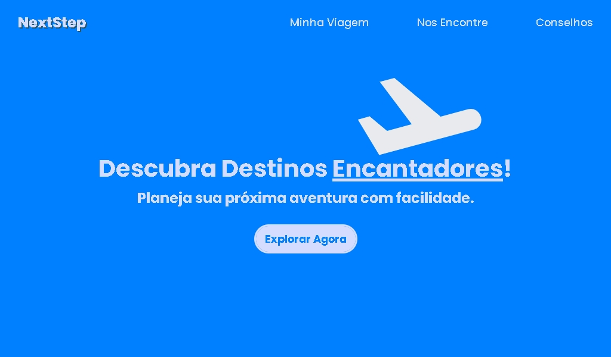

<h1 align="center">Viagens Landing Page</h1>

  
Primeiro projeto da trilha 2 da plataforma <a href="https://app.devstart.tech">DEVstart</a>.

  <a href="#-tecnologias">Tecnologias</a>&nbsp;&nbsp;&nbsp;|&nbsp;&nbsp;&nbsp;
  <a href="#-projeto">Projeto</a>&nbsp;&nbsp;&nbsp;

  

## 🚀 Tecnologias

Esse projeto foi desenvolvido com as seguintes tecnologias:

- HTML e CSS
- JavaScript
- Responsividade para mobile e menu hamburguer
- Algumas tags semânticas

## 💻 Projeto

A **NextStep** é um projeto da plataforma [DEVStart](https://app.devstart.tech), onde precisei criar uma Landing Page de viagens. O projeto não tem um design no figma, então utilizei o ChatGPT para me ajudar com as idéias de design e frases. Com ajuda de outro site, eu usei a palheta de cores geradas.

- [Acesse o projeto online](https://phdiias.github.io/viagens--landing-page/)